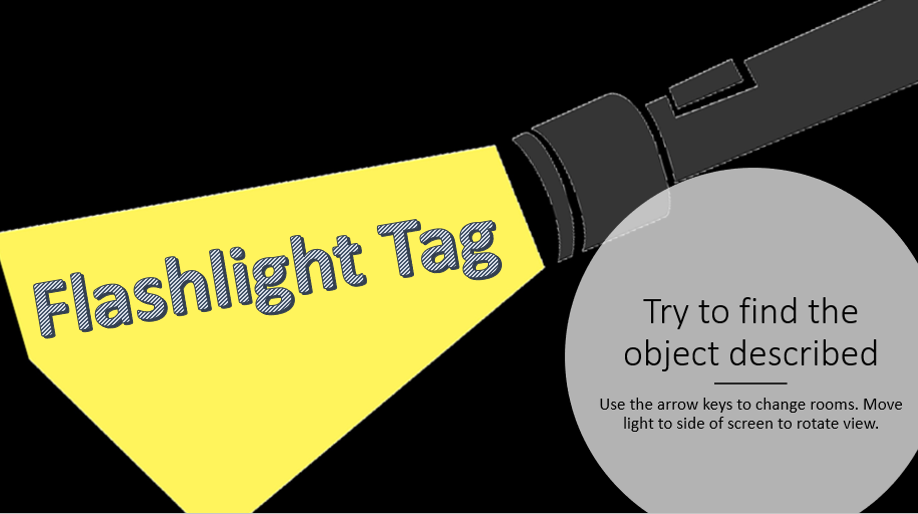
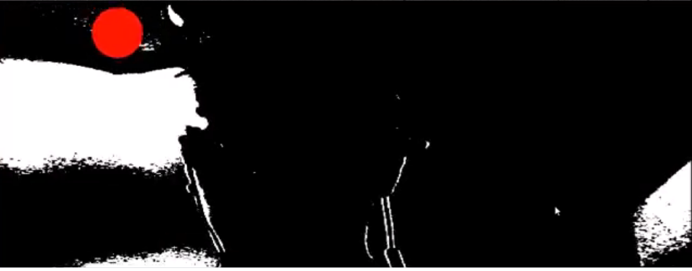
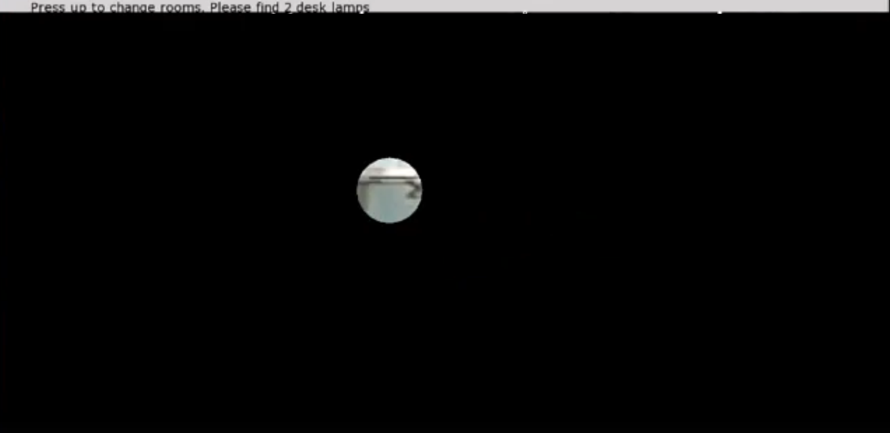
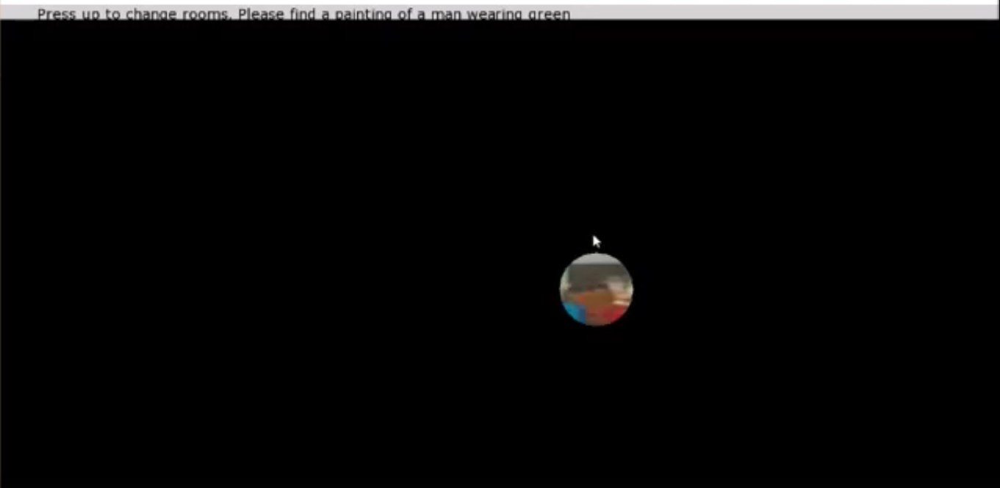

# Flashlight Tag

**What is it?** virtual ISpy, with a real flashlight. Navigate around the house and move the cursor to explore each room. When you find the instructed object, you win! Includes a calibration mode to adjust for the lighting in your room:

Use the arrow keys to change rooms and move your flashlight around the screen to see different areas:

Cursor can also be moved with mouse:

**How to Run:** The game is playable as is, all you need to do is run Flashlight Tag.exe in the root folder. If you want to delve into the code, there's also a few easy customizations:
* By default, the flashlight is detected using your laptop's built in camera. To change cameras, change the index of the `vid_grabber_.setDeviceID(0); ` line in controller.cpp.
* If you want to play with the mouse instead of a flashlight change the `control_ = mouse_;` in ofApp.cpp instead of `control_ = flash;`

**Project Goals, Skills, and Tools**
* The main objective presented by the class was to create a clean, well-structured project using openFrameworks
* My personal goal was to come up with a creative way to control the game, which eventually led me to use a flashlight
* Some of the skills I developed while working on this project:
	* Researching which tools are best for the job
	* Communicating my progress to others and responding to feedback
	* Working under both time constraints and outside requirements
* The new tools and software I got experience with:
	* OpenCV
	* OpenFrameworks
	* Despite some previous practice, this was my first real project with C++

**Reflection**
* I learned a lot from this project, and I'm happy with how it turned out
	* My C++ skills improved significantly from practice
	* I got the chance to see how to translate an idea to a model on paper to a working program
	* I gained experience working with some new tools that could be explored further
* I also have a number of improvements that could be made with further effort
	* The cursor lags in both flashlight and mouse mode, but not calibration mode	
		* In order to show the room within the cursor, currently the program iterates over every pixel in a square around the cursor, which is time consuming. Making this more efficent would likely fix the problem
	* I originally had an idea to allow the user to see 4 different sides of a room and rotate around them. I didn't get to this before the deadline but the code is implemented in such a way to make this extension

